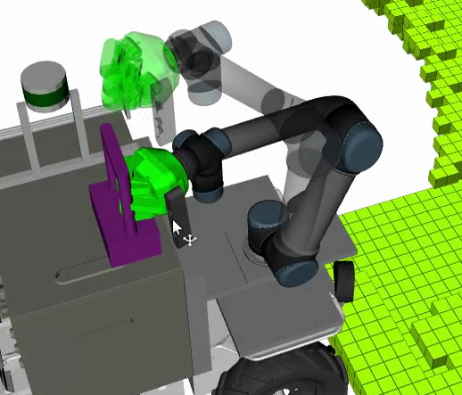

# Meta-Package for the UR5 and 3 Finger-Gripper mounted on Julius



## Packagelist:

* tbf_gripper_autonomy ([Doc](./tbf_gripper_autonomy/README.md))
* tbf_gripper_hand ([Doc](./tbf_gripper_hand/README.md))
* tbf_gripper_launch ([Doc](./tbf_gripper_launch/README.md))
* tbf_gripper_perception ([Doc](./tbf_gripper_perception/README.md))
* tbf_gripper_viz ([Doc](tbf_gripper_viz/README.md))
* tbf_gripper_tools ([Doc](./tbf_gripper_tools/README.md))

## General information

The manipulation unit consists of three hardware parts: the UR5, the Robotiq S model gripper and the Asus Xtion Pro Live.
Launch files for those devices are located in the `julius_base` package.
The following launch file calls may be used to start them:

```bash
roslaunch julius_base ur5_modern_plain_driver.launch
roslaunch julius_base julius_base robotiq_hand.launch
roslaunch julius_base xtion_gripper.launch
```

As ROS provides a powerful planning and controlling interface with MoveIt!; one may also invoke:

```bash
roslaunch julius_moveit moveit.launch
```

## Important information

Please refuse from directly controlling the robotic arm (UR5) via WiFi.
It can result in unexpected behaviour.
Best practice is to run both, the driver and `move_group` on one of the PC's mounted on Julius.
