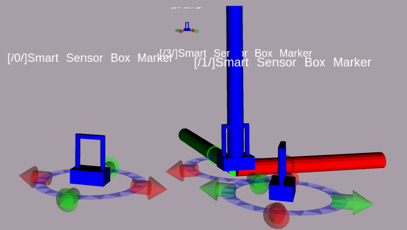

# Visualization package for the manipulation unit of Julius



## Dependencies:

* [rospy](http://wiki.ros.org/rospy)
* [RQT-Gui](http://wiki.ros.org/rqt_gui)
* [visualization_msgs](http://wiki.ros.org/visualization_msgs)
* [interactive_markers](http://wiki.ros.org/interactive_markers)
* [message_filters](http://wiki.ros.org/message_filters)
* [geometry_msgs](http://wiki.ros.org/geometry_msgs)
* [tf](http://wiki.ros.org/tf)
* [robotiq_s_model_control](http://wiki.ros.org/robotiq_s_model_control)
* [control_msgs](http://wiki.ros.org/control_msgs)
* [actionlib](http://wiki.ros.org/actionlib)
* [python_qt_binding](http://wiki.ros.org/python_qt_binding)

## Python Packages

* tbf_gripper_rqt
* tbf_gripper_rviz

## Common launch calls:

None

The package stores several rqt-plugins, in case they are not available, please try:
```bash
rqt --force-discover
```
Or try to list plugins via:
```bash
rqt --standalone tbf_gripper_viz 
```